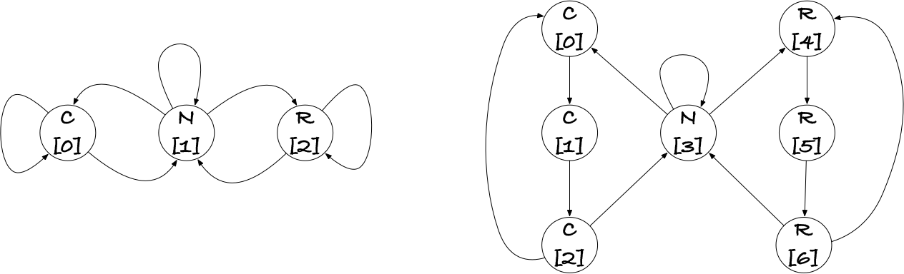

# A hidden Markov model gene-finder

In the exercise below, you will implement and experiment with an example of how to apply a HMM for identifying coding regions(genes) in genetic material. We consider only procaryotes, which have a particular simple gene format. A gene is a sequence of triplets, codons, that encode proteins. We saw this in the first project. Now, we assume that we have a genomic sequence, and our goal is to recognise which part of the genome encodes genes, and which do not.

Genes can be found on both strands of a genome, so as we scan along the genome sequence, we might encounter them in the direction we are scanning, or we might encounter them in the reverse order, seeing them backwards, so to speak. In either case, we recon that gene coding sequences likely have a different nucleotide composition, and we will exploit this in our model.

We build a hidden Markov model, where the hidden states are:

- Non-coding: we are not in a coding sequence
- Coding: We are inside a gene that is coded in the direction we are reading
- Reverse coding: We are inside a gene that is encoded on the other strand than then one we are scanning

We will use two different models. A 3-state HMM that encodes only the three states we just listed, and a 7-state HMM that adds a little more structure. It models that genes come as codons, so when we are inside a gene, we should always a number of nucleotides divisible by three, and if the nucleotide composition is different for different codon positions, it can model that as well.

We can draw the two models like this:




Both have coding states (C), non-coding states (N), and reverse-coding states (R), but the second has three of each of C and R. The numbers in square brackets in the states are just that, numbers. Specifically numbers from zero up to the number of states minus one. Representing states like that is convinient if we are to use states to index into vectors and matrices.

There is another purpose to this project, beyond learning how to implement and apply hidden Markov models. We will do the project in a so-called [Jupyter Notebook](https://jupyter.org). Jupyter is one of many ways of combining documentation and code, a technique known as literate programming although it is rarely used in programming but quite frequently in data science. The text you are reading now is, in fact, written in a Jupyter Notebook that contains both the project description and the template code you need to get started. The file is named `hmm.ipynb`, and you should edit that file to fill out the missing details.

**WARNING:** DO NOT EDIT `README.md`. When you commit to GitHub, `README.md` will be overwritten by a file extracted from `hmm.ipynb`. The only file you should edit in this project is `hmm.ipynb` (or any additional files you create for testing the code you write in `hmm.ipynb`).

You can edit Jupyter Notebooks in several different ways. If you follow the link above to [jupyter.org](https://jupyter.org) you can get a browser interface. If you are using VSCode as your editor, you can install an extension and edit Jupyter files natively. (That is what I am doing). Your first exercise is to figure out how to edit `hmm.ipynb`. When you have managed that, proceed to the next section.

Whenever you commit the notebook to GitHub it is evaluated from scratch, and the result becomes the new README.md. If you are evaluating cells out of order, your state might be different from one where you evaluate the notebook from the beginning, so be careful to check that the clean evaluation is correct.

## Training data

For this project, we have two bacterial genomes that someone has painstakingly annotated with genes (and I have then fracked up the good work to make the data look the way our models assume it will rather than the mess that God created).

The two genomes, found in `data/genome1.fa` and `data/genome2.fa`, are stored in [FASTA files](https://en.wikipedia.org/wiki/FASTA_format), and I have provided a function you can used to load them. (It is not entirely general, but it suffices for parsing the FASTA files you need for this project).

The function is in a module in `src` and we can import it like this:


```python
# load modules from src directory
import sys
sys.path.insert(0, 'src')
```


```python
# get the function for reading a fasta file
from fasta import read_fasta_file
```

With the function in hand, we can try to load one of the genomes and see what is in the file:


```python
genome1 = read_fasta_file('data/genome1.fa')
genome2 = read_fasta_file('data/genome2.fa')
print(genome1.keys())
print(genome2.keys())

```

    dict_keys(['genome', 'annotation'])
    dict_keys(['genome', 'annotation'])


It looks like you get a dictionary with two keys, `genome` and `annotation`, and I will bet you good money that the former is the genomic sequence and the second the annotation. Let's have a look at them (but don't print all of them, as they are quite long):


```python
print(len(genome1['genome']), len(genome1['annotation']))
print(genome1['genome'][:60])
print(genome1['annotation'][:60])
```

    1852441 1852441
    TTGTTGATATTCTGTTTTTTCTTTTTTAGTTTTCCACATGAAAAATAGTTGAAAACAATA
    NNNNNNNNNNNNNNNNNNNNNNNNNNNNNNNNNNNNNNNNNNNNNNNNNNNNNNNNNNNN


The genomic sequence is a sequence over the letters:


```python
print(set(genome1['genome']))
```

    {'A', 'G', 'C', 'T'}


while the annotation is a sequence over the letters


```python
print(set(genome1['annotation']))
```

    {'C', 'R', 'N'}


that should be interpreted as non-coding, reverse-coding, and coding.

If we are to analyse such a genome using a hidden Markov model, we must be able to use both the observable letters (the genomic sequence) and the hidden states (the annotation) as indices into matrices or vectors.

For the three-states model, the $\pi$ vector should have length three, and we should be able to index into it with hidden states, $\pi[z]$; we should be able to index into the transition matrix $T$, a $3\times 3$ matrix, with two hidden states $T[s,t]$, and we should be able to index into the emission matrix, a $3\times 4$ matrix, with a hidden state $z$ and an observed nucleotide, $x$, $E[z,x]$.

We could use dictionaries for this indexing, but it is much more convinient to represent vectors as vectors and matrices as matrices (we will see how below), and that requires that we use integers as indices. We need to map the two strings into lists of integers, in some way such that for the genomic sequence the integers are 0, 1, 2, or 3, and such that the annotation maps to integers 0, 1, or 3.

I'll show you have to map the genomic sequence, and then you should write a function for mapping the annotation.


```python
def observed_states(x: str) -> list[int]:
    """
    Maps a DNA sequence to HMM emissions.
    
    >>> observed_states('ACAGTTC')
    [0, 1, 0, 2, 3, 3, 1]
    """
    map = {'A': 0, 'C': 1, 'G': 2, 'T': 3}
    return [map[a] for a in x]

def rev_observed_states(obs: list[int]) -> str:
    """
    Reverses the observable states mapping.
    
    In this notebook, we only use this for testing, but you can use it as
    inspiration to write similar functions for the hidden states where you
    do want to be able to reverse when you do decoding.
        
    >>> rev_observed_states([0, 1, 0, 2, 3, 3, 1])
    'ACAGTTC'
    """
    return ''.join('ACGT'[x] for x in obs)

```


```python
x = genome1['genome'][:10] # A shorter string to play with
y = observed_states(x)
print('mapped genome:', y)
print(x, rev_observed_states(y))
assert x == rev_observed_states(y)
```

    mapped genome: [3, 3, 2, 3, 3, 2, 0, 3, 0, 3]
    TTGTTGATAT TTGTTGATAT


```python
# FIXME: You need to implement the corresponding function for annotations
# In the figure above, the states map as C -> 0, N -> 1 and R -> 2 but
# you do not need to use that; but you do need to be consistent everywhere
def hidden_states(x: str) -> list[int]:
    """
    Map a genome annotation to hidden states (index 0, 1, or 2).
    
    >>> hidden_states('NNCCCCCCNNRRRRRRN')
    [1, 1, 0, 0, 0, 0, 0, 0, 1, 1, 2, 2, 2, 2, 2, 2, 1]
    """
    map = {'C': 0, 'N': 1, 'R': 2}
    return [map[a] for a in x]

def rev_hidden_states(hid: list[int]) -> str:
    """
    Reverse the map of hidden states.
    
    This function should also be useful if you wish to convert a decoding
    to the annotation format at some point in the future.
    
    >>> rev_hidden_states([1, 1, 0, 0, 0, 0, 0, 0, 1, 1, 2, 2, 2, 2, 2, 2, 1])
    'NNCCCCCCNNRRRRRRN'
    """
    return ''.join("CNR"[h] for h in hid)

```


```python
x = genome1['annotation'][220:250] # A shorter string to play with
y = hidden_states(x)
print('mapped annotation:', y)
print(x, rev_hidden_states(y))
assert x == rev_hidden_states(y)
```

    mapped annotation: [1, 1, 1, 1, 1, 1, 1, 1, 1, 1, 1, 0, 0, 0, 0, 0, 0, 0, 0, 0, 0, 0, 0, 0, 0, 0, 0, 0, 0, 0]
    NNNNNNNNNNNCCCCCCCCCCCCCCCCCCC NNNNNNNNNNNCCCCCCCCCCCCCCCCCCC


There is a problem for the seven-state HMM, though. Our annotations have three states, `C`, `N`, and `R`, but the `C` and `R` annotations map to three separate states each in the seven-state model!

It's not that it is a complete mystery which hidden states the different `C` or `R` annotations should map to. The coding regions come in triplets, so if we split a stretch of `C` positions into triplets

```
    ...NNCCCCCCCCCCCCCCCNN...
=>  ...NN[CCC][CCC][CCC][CCC][CCC]NN...
```

they should obviously be mapped to repeats of `[0,1,2]` (according to the figure above), so this annotation should be interpreted as

```
    ...NN[CCC][CCC][CCC][CCC][CCC]NN...
=>  ...33[012][012][012][012][012]33...
```

Likewise for stretches of `R` annotations.

There are many fine ways to achieve this. A simple one is to look at the annotation and hidden state in the previous position and set the hidden state at the current position based on that.

```python
 if ann[i] == 'C' and ann[i-1] != 'C':
     hid[i] = 0
 if ann[i] == 'C' and ann[i-1] == 'C':
     hid[i] = (hid[i-1] + 1) % 3
```

I don't really care how you do it, but I want it done. Write me a function that extracts the hidden states from a seven-state model.


```python
# FIXME: You need to implement the corresponding function for annotations
# In the figure above, the states map as C -> 0/1/2, N -> 3 and R -> 4/5/6 but
# you do not need to use that; but you do need to be consistent everywhere
def hidden_states7(x: str) -> list[int]:
    """
    Map a genome annotation to hidden states.
    
    >>> hidden_states7('NNCCCCCCNNRRRRRRN')
    [3, 3, 0, 1, 2, 0, 1, 2, 3, 3, 4, 5, 6, 4, 5, 6, 3]
    """
    ann = [-1] * len(x)
    for i, a in enumerate(x):
        match a:
            case 'N': ann[i] = 3
            case 'C' if x[i - 1] != 'C':
                ann[i] = 0
            case 'C' if x[i - 1] == 'C':
                ann[i] = (ann[i - 1] + 1) % 3
            case 'R' if x[i - 1] != 'R':
                ann[i] = 4
            case 'R' if x[i - 1] == 'R':
                ann[i] = (ann[i - 1] -4 + 1) % 3 + 4
    return ann

def rev_hidden_states7(hid: list[int]) -> str:
    """
    Reverse the map of hidden states.
    
    This function should also be useful if you wish to convert a decoding
    to the annotation format at some point in the future.
    
    >>> rev_hidden_states7([3, 3, 0, 1, 2, 0, 1, 2, 3, 3, 4, 5, 6, 4, 5, 6, 3])
    'NNCCCCCCNNRRRRRRN'
    """
    return ''.join("CCCNRRR"[h] for h in hid)

```


```python
x = genome1['annotation'][45110:45210]  # A shorter string to play with
y = hidden_states7(x)
print('mapped annotation:', y)
print(x, rev_hidden_states7(y))
assert x == rev_hidden_states7(y)

```

    mapped annotation: [3, 3, 3, 3, 3, 3, 3, 3, 3, 3, 3, 3, 4, 5, 6, 4, 5, 6, 4, 5, 6, 4, 5, 6, 4, 5, 6, 4, 5, 6, 4, 5, 6, 4, 5, 6, 4, 5, 6, 4, 5, 6, 4, 5, 6, 4, 5, 6, 4, 5, 6, 4, 5, 6, 4, 5, 6, 4, 5, 6, 4, 5, 6, 4, 5, 6, 4, 5, 6, 4, 5, 6, 4, 5, 6, 4, 5, 6, 4, 5, 6, 4, 5, 6, 4, 5, 6, 4, 5, 6, 4, 5, 6, 4, 5, 6, 4, 5, 6, 4]
    NNNNNNNNNNNNRRRRRRRRRRRRRRRRRRRRRRRRRRRRRRRRRRRRRRRRRRRRRRRRRRRRRRRRRRRRRRRRRRRRRRRRRRRRRRRRRRRRRRRR NNNNNNNNNNNNRRRRRRRRRRRRRRRRRRRRRRRRRRRRRRRRRRRRRRRRRRRRRRRRRRRRRRRRRRRRRRRRRRRRRRRRRRRRRRRRRRRRRRRR


## Computing likelihoods

Now that we have transformed our input sequences into integer lists, we should be able to use these with a hidden Markov model. Let's make some (arbitrary) HMM parameters--`pi`, `T` and `E`--to see how.

We will use the module `numpy` for this. It is a powerful library for linear algebra, but don't worry, we will just use it to make one- and two-dimensional tables that we index into efficiently. 


```python
import numpy as np
pi = np.array([0, 1, 0]) # always start in N (== 1)
T = np.array([
    [0.8, 0.2, 0.0],  # Transitions out of C
    [0.1, 0.8, 0.1],  # Transitions out of N
    [0.0, 0.2, 0.8],  # Transitions out of R
])
E = np.array([
    [0.3, 0.2, 0.1, 0.4],  # Emissions from C
    [0.5, 0.1, 0.2, 0.2],  # Emissions from N
    [0.2, 0.2, 0.3, 0.3],  # Emissions from R
])
```

The parameters here are not chosen to fit the model (which should be obvious from how regular the numbers look), but they are valid parameters in the sense that the initial transitions sum to one, that the out transitions sum to one for each state, and that the emissions sum to one for each state as well.


```python
from numpy.testing import assert_almost_equal
assert_almost_equal(sum(pi), 1) # use "almost equal" on floats; never ==
for s in [0, 1, 2]:
    assert_almost_equal(sum(T[s,:]), 1)
for s in [0, 1, 2]:
    assert_almost_equal(sum(E[s, :]), 1)

```

As represented here, we have the three parameters floating around independently. There isn't anything wrong with that as such, but there are occations where you want to make sure that the parameters you have fitted for a model do not get mixed up with parameters from elsewhere, and it is easier to keep one object under control than three. The code below lets you wrap up the three parameters we use as a single object that we can pass around functions.

You don't need to know how it works (although it isn't that complicated), as long as you know that you can call the function `hmm_params(pi,T,E)` to wrap the three parameters, and from the wrapped object, `theta`, you can get the parameters back, including a number `K` that is the number of hidden states.

```python
K, pi, T, E = theta
```

The number `K` is useful in some of the algorithms, and although you can always get it from the other three, it is more convinient to have it directly.


```python
from numpy.typing import ArrayLike
from typing import NamedTuple

HMMParam = NamedTuple('HMMParam', [
    ('K', int),          # Number of hidden states
    ('pi', ArrayLike),
    ('T', ArrayLike),
    ('E', ArrayLike)
])

def hmm_params(pi: ArrayLike, T: ArrayLike, E: ArrayLike) -> HMMParam:
    """Wraps HMM parameters in a tuple so we can pass them to functions
    as a unit."""
    # Consistency check.
    assert len(pi.shape) == 1  # must be one dimensional
    assert len(T.shape) == 2   # must be two dimensional
    assert len(E.shape) == 2   # must be two dimensional

    # Get the number of states from pi and check that
    # it matches with the expected dimensions in T and E.
    K = len(pi)
    assert T.shape == (K, K)
    assert E.shape[0] == K
    
    # Consistency check done, we accept and wrap the parameters
    return HMMParam(K, pi, T, E)

theta = hmm_params(pi, T, E) # combining parameters from above


```

Likewise, we can wrap up our data:


```python
HMMData = NamedTuple('HMMData', [
    ('k', int),
    ('x', list[int]),
    ('z', list[int])
])

def hmm_data(k: int, x: str, z: str) -> HMMData:
    """
    Wrap a genomic sequence and an annotation as an HMMData object.
    
    The parameter k determines if we use the three or seven state HMM.
    """
    assert len(x) == len(z)
    match k:
        case 3:
            return HMMData(k, observed_states(x), hidden_states(z))
        case 7:
            return HMMData(k, observed_states(x), hidden_states7(z))
        case _:
            assert False, "We only have 3 and 7 state models"

```


```python
# Let's just wrap up all our data once and for all, so we have it ready to go later
data1_3 = hmm_data(3, genome1['genome'], genome1['annotation'])
data1_7 = hmm_data(7, genome1['genome'], genome1['annotation'])
data2_3 = hmm_data(3, genome2['genome'], genome2['annotation'])
data2_7 = hmm_data(7, genome2['genome'], genome2['annotation'])
```

The probability that we go from state $s$ to state $t$ is $T[s,t]$, so with our mapped sequences, let's call them `obs` for observed and `hid` for hidden, the probability of the transition at position `i` should be `T[hid[i],hid[i+1]]`. The probabiity of emitting what we have at position is `E[hid[i],obs[i]]`, and the probability of starting in the first state it `pi[hid[0]]`.

Use these observations to implement a function that computes the likelihood of a genomic sequence and an annotation.


```python
def lik(data: HMMData, theta: HMMParam) -> float:
    """
    Compute the likelihood of the data (obs,hid) given the parameters, theta.
    """
    k1, x, z = data
    k2, pi, T, E = theta
    assert k1 == k2
    
    # FIXME: compute the likelihood
    p = pi[z[0]]
    for i, s in enumerate(z[1:]):
        p *= T[z[i], s]
    for i, _ in enumerate(z):
        p *= E[z[i], x[i]]
    return p

```


```python
# Some rudementary tests that it works; maybe you should test more?
assert_almost_equal(lik(hmm_data(3, 'A', 'N'), theta), 0.5)
assert_almost_equal(lik(hmm_data(3, 'AC', 'NC'), theta), 0.01)
assert_almost_equal(lik(hmm_data(3, 'ACGTTCGA', 'NCCCNRRR'), theta), 7.86432e-09)

```

As should be obvious here, the likelihood gets very small very quickly. This is expected, since we are multiplying numbers in the range 0 to 1 together, and there isn't anything we can do about. It is also a problem, however, since floating point numbers have a finite resolution and eventually we will see all the likelihoods as indistinguishable from zero.

Because of this, we usually do not compute the likelihood of large data, but rather the *log*-likelihood.

The logarithm will also run into problems eventually--there is no good way of dealing with floating point numbers--but it doesn't happen as quickly, and if we compute the log-likelihood we can easily deal with genomic sized data (especially when the genomes in question are bacterial).

Implement a function that computes the logarithm of the likelihood instead. You shouldn't just take the log of the function above--that would defeat the purpose as we would get zero for long sequences, and taking the log of that is not valid--but you can use the log of the input parameters and replace multipliation with addition, and then you should be fine.


```python
def log_each(x: ArrayLike) -> ArrayLike:
    """
    Take the log of each component.
    
    This is just numpy.log, but disabling warnings if x contains zero.
    """
    with np.errstate(divide='ignore'):
        return np.log(x)

def log_lik(data: HMMData, theta: HMMParam) -> float:
    """
    Compute the log-likelihood of the data (obs,hid) given the parameters, theta.
    """
    k1, x, z = data
    k2, pi, T, E = theta
    assert k1 == k2

    pi, T, E = log_each(pi), log_each(T), log_each(E)

    # FIXME: compute the likelihood
    p = pi[z[0]]
    for i, s in enumerate(z[1:]):
        p += T[z[i], s]
    for i, _ in enumerate(z):
        p += E[z[i], x[i]]
    return p

```


```python
# Some rudementary tests that it works; maybe you should test more?
assert_almost_equal(log_lik(hmm_data(3, 'A', 'N'), theta), np.log(0.5))
assert_almost_equal(log_lik(hmm_data(3, 'AC', 'NC'), theta), np.log(0.01))
assert_almost_equal(log_lik(hmm_data(3, 'ACGTTCGA', 'NCCCNRRR'), theta), np.log(7.86432e-09))

```

If we can compute the log-likelihood of short sequences, we should also be able to compute them for our full genomes--it just might take a little longer.


```python
assert_almost_equal(log_lik(data1_3, theta), -3055335.10505437)
assert_almost_equal(log_lik(data2_3, theta), -float("inf"))
```

The log-likelihood for the second genome is -inf, which means that the likelihood is zero (in this context). That is probably because the data contains a transition that has probability zero in the parameters, and that is likely an indication that the parameters we pulled our of a hat weren't that good after all. We should probably estimate the parameters instead of guessing them.

## Estimating parameters

When we have both the observed and the hidden sequence, estimating paramters is easy. We simply count how often we see the various events, and then we normalise to get probabilities. If you want to get technical, we are doing a maximum likelihood estimation on multinomial distributions, but why get technical?

We will estimate from our data sets independently, so we don't need to count to figure out that `pi` should give one state probability one and all others probability zero; the first observed hidden state is the only state we observe the model starting in. (In general, we would estimate from many data sets, but we don't care here; in any case, both sequences start in `N`).


```python
def estimate_pi(data: HMMData) -> ArrayLike:
    """Estimate the starting probability from the two sequences in an HMM with K hidden states."""
    k, _, z = data
    pi = np.zeros(k)
    pi[z[0]] = 1.0
    return pi
```


```python
# Estimating pi for 3-state HMM
pi_3 = estimate_pi(data1_3)
assert_almost_equal(pi_3, [0, 1, 0])
# Estimating pi for 7-state HMM
pi_7 = estimate_pi(data1_7)
assert_almost_equal(pi_7, [0, 0, 0, 1, 0, 0, 0])
```

For the emission probabilities you need to count how often we see `(hid[i],obs[i])` and for transition probabilities how often you see `(obs[i-1],obs[i])`. The functions below should count these.


```python
def count_emissions(data: HMMData) -> ArrayLike:
    """Count how often we see the different emissions in the data."""
    k, obs, hid = data
    counts = np.zeros((k, 4))  # How often each of the k states emit A,C,G,T.
    # FIXME: count the emissions
    for x, z in zip(obs, hid):
        counts[z, x] += 1
    return counts
```


```python
assert_almost_equal(
    count_emissions(data1_3),
    np.array([[227971., 133045., 152692., 214779.],
              [161166.,  90377.,  94437., 159197.],
              [183196., 129927., 112961., 192693.]])
)
assert_almost_equal(
    count_emissions(data2_3),
    np.array([[275056., 135918., 164202., 252896.],
              [166547.,  83826.,  86048., 166486.],
              [271660., 174583., 143318., 290945.]])
)

```


```python
def count_transitions(data: HMMData) -> ArrayLike:
    """Count how often we see the different transitions in the data."""
    k, _, z = data
    counts = np.zeros((k, k))  # How often each of the k*k state transitions
    # FIXME: count the transitions
    for i in range(len(z) - 1):
        counts[z[i], z[i+1]] += 1
    return counts
```


```python
def estimate_trans(data: HMMData) -> ArrayLike:
    """Estimate the transition matrix from the data."""
    counts = count_transitions(data)
    for i, row in enumerate(counts):
        counts[i] /= sum(row)
    return counts
```

## Testing

Using doc-test to test the functions in the notebook.


```python
import doctest
doctest.testmod(verbose=True)

```

    Trying:
        hidden_states('NNCCCCCCNNRRRRRRN')
    Expecting:
        [1, 1, 0, 0, 0, 0, 0, 0, 1, 1, 2, 2, 2, 2, 2, 2, 1]
    ok
    Trying:
        hidden_states7('NNCCCCCCNNRRRRRRN')
    Expecting:
        [3, 3, 0, 1, 2, 0, 1, 2, 3, 3, 4, 5, 6, 4, 5, 6, 3]
    ok
    Trying:
        observed_states('ACAGTTC')
    Expecting:
        [0, 1, 0, 2, 3, 3, 1]
    ok
    Trying:
        rev_hidden_states([1, 1, 0, 0, 0, 0, 0, 0, 1, 1, 2, 2, 2, 2, 2, 2, 1])
    Expecting:
        'NNCCCCCCNNRRRRRRN'
    ok
    Trying:
        rev_hidden_states7([3, 3, 0, 1, 2, 0, 1, 2, 3, 3, 4, 5, 6, 4, 5, 6, 3])
    Expecting:
        'NNCCCCCCNNRRRRRRN'
    ok
    Trying:
        rev_observed_states([0, 1, 0, 2, 3, 3, 1])
    Expecting:
        'ACAGTTC'
    ok
    12 items had no tests:
        __main__
        __main__.HMMData
        __main__.HMMParam
        __main__.count_emissions
        __main__.count_transitions
        __main__.estimate_pi
        __main__.estimate_trans
        __main__.hmm_data
        __main__.hmm_params
        __main__.lik
        __main__.log_each
        __main__.log_lik
    6 items passed all tests:
       1 tests in __main__.hidden_states
       1 tests in __main__.hidden_states7
       1 tests in __main__.observed_states
       1 tests in __main__.rev_hidden_states
       1 tests in __main__.rev_hidden_states7
       1 tests in __main__.rev_observed_states
    6 tests in 18 items.
    6 passed and 0 failed.
    Test passed.


    TestResults(failed=0, attempted=6)


